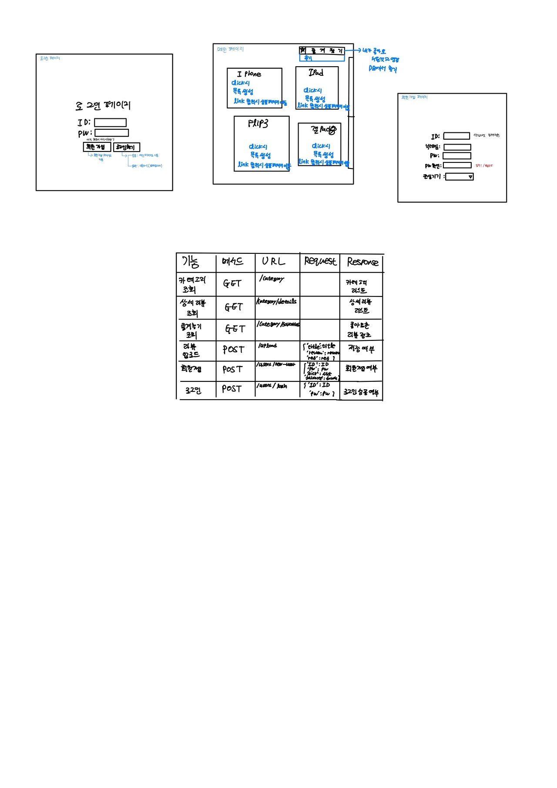

# [오늘 배운 것!]

### 1. 와이어 프레임 작성하기

버튼 혹은 링크를 클릭하면 어떤 기능이 나올 지 미리 작성하고, 무슨 무슨 페이지(로그인 페이지, 회원가입 페이지, 메인 페이지 등등)를 작성할지 미리 작성해봤다. 이를 통해 내일부터 HTML을 이용해 뼈대를 잡고, CSS를 사용해 꾸미기를 해볼 것이다

### 2. Git&GitHub 사용법

말로만 들었던 Git과 GitHub의 사용법을 익혔다.

1. 로컬 저장소: 내 컴퓨터 저장소를 뜻한다. 데스크탑에 Hello라는 프로젝트 폴더를 만들었다고 가정해보자

2. 로컬 레포지토리(Local Repo): 내 컴퓨터 데스크탑에 위치한 Hello폴더를 로컬 레포지토리로 가져올 수 있다.(초기화!)

3. 원격 저장소(원격 Repo): Local Repo에 있는 코드들의 변경사항을 GitHub에 존재하는 원격 Repo에 저장할 수 있다. 이를 통해 버전관리를 다른 팀원들과 할 수 있다.

4. Commit(반영하다): 내 폴더에 있는 코드들의 변경상태(누가, 언제, 무엇을)를 찰칵 찍어서 Local Repo에 알려주는 것이다.

5. History: Commit의 목록을 시간순으로 알 수 있다. 이를 통해 누가 코드를 수정했고, 언제 코드를 수정했고, 무엇을 수정했는지 시간순으로 알 수 있으며, 버전이 어떻게 관리되고 있는지 일목요연하게 확인 할 수 있다.

6. Push&Pull : 커밋이 겹겹이 쌓인 Local Repo의 변경사항을 원격 Repo에 저장하는 것이 Push이다. 반대로 원격 Repo의 내용을 Local Repo로 가져오는 것을 Pull이라고 한다. Git과 GitHub를 사용해 버전관리를 할 경우 Pull -> Commit(복수) -> Push의 순으로 하는 것이 좋다!

7. Add(Staging): 복수의 파일에 변경사항이 있을 경우, 거기서 내가 원하는 것만 Stage에 올려 커밋하는내 것이다.

8. Clone: 원격 Repo에 있는 프로젝트 폴더를 원격 Repo가 아닌 내 컴퓨터로 가져오는 것이 Clone이다. Pull과 처음에 개념이 헷갈렸지만 차차 사용하면서 익숙해지기로 하자

9. Issue: 버그리포트, 새로운 기능 추가 등등의 작업을 할때 issue를 등록해 작업자를 할당하고, 팀원들끼리 토론하는 것이다.

10. Branch: issue를 등록해 할 일과 작업자를 할당한 후, 작업단위를 나누어(마스터 브랜치로부터 떨어져서) 작업하는 것을 말한다. 여기서 주의할 점은 브랜치를 나누어 마스터 브랜치, A 브랜치, B 브랜치라는 구조가 있을 때 A브랜치와 B브랜치에서 같은 파일을 가지고 작업하면 '충돌'이 발생한다. 충돌이 발생할 경우 Git이 자동으로 알려주고, 고칠 수 있는 방법이 있지만 아예 그런 일이 일어나지 않는 것이 중요!

11. Merge: 여러 분기로 나누어진 Branch를 마스터 Branch(다른 Branch도 가능)에 병합하는 것을 말한다. 즉, 특정 Branch의 Commit들을 마스터 Branch에 모두 반영하는 것을 말한다. 이때 여러 Branch가 하나의 파일을 대상으로 작업을 했다면 충돌이 발생한다.
